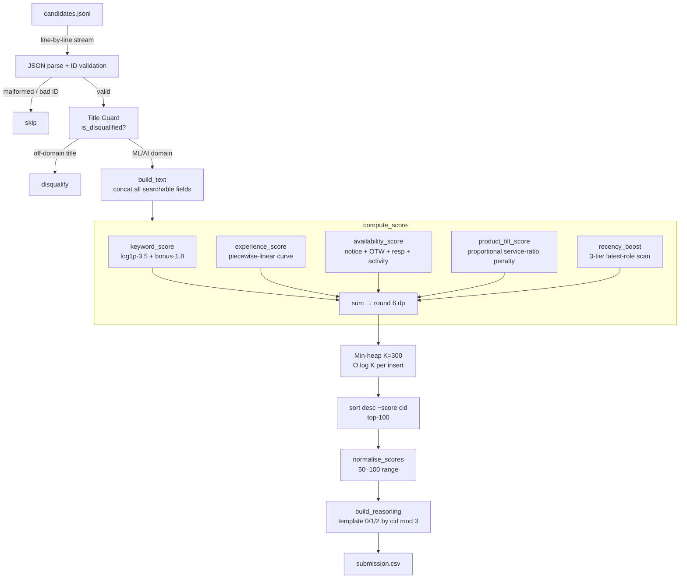

# RedRob Ranker — India Runs Data & AI Challenge

> **Hack2Skill · India Runs · Track 1: Data & AI**
> Smart AI Candidate Ranking System
>
> Built by [Yash Sharma](https://yashsharma01.vercel.app/) · [@Yashsh101](https://github.com/Yashsh101)

---

## Problem Statement

Given a pool of **~100,000 candidate profiles** (JSONL, one object per line), automatically rank candidates for the role of **Senior AI/ML Engineer at Redrob** and produce a top-100 shortlist with:

- A numeric score per candidate
- A rank from 1–100
- A human-readable, single-line reasoning string

The evaluation metric is **NDCG@10 / NDCG@50 / MAP** against a held-out relevance judgement set. Precision of ranking — not just recall — is what the leaderboard measures.

---

## Architecture



---

## Ranking Methodology

The ranker computes a **composite scalar score** from six independent signal dimensions. No ML model, no embeddings, no GPU — entirely rule-based and deterministic.

### 1 · Keyword Relevance

```
keyword_score = log1p(core_hits) × 3.5  +  bonus_hits × 1.8
```

| List | Size | Multiplier | Purpose |
|---|---|---|---|
| `CORE_KEYWORDS` | 60 terms | log-scaled × 3.5 | Standard JD signals: RAG, embeddings, LLM, NLP, MLOps, frameworks |
| `BONUS_KEYWORDS` | 16 terms | linear × 1.8 | High-specificity signals: LTR, cross-encoder, hr-tech, knowledge-graph |

**Why log-scale?** A candidate with 30 keyword hits is not 30× more relevant than one with 1 hit. `log1p` compresses the raw count while still rewarding breadth, preventing keyword-stuffed profiles from crowding out genuine experts with concise summaries.

### 2 · Experience Fit

A continuous piecewise-linear curve maps years-of-experience (YoE) to a score, peaking at the Senior role sweet-spot of 5–9 years.

```
YoE   →  Score
  0   →  0.0   (no experience)
  2   →  1.6   (junior)
  5   →  5.2   (approaching senior)
  7   →  6.0   (peak)
  9   →  5.6   (still strong senior)
 14   →  3.6   (principal / staff territory)
 20   →  0.6   (overqualified floor)
20+   →  0.3   (asymptotic)
```

This avoids the hard bucket problem of the original implementation where every candidate between 5–9 years received exactly the same score.

### 3 · Availability

Derived from Redrob platform signals:

| Signal | Points |
|---|---|
| `notice_period_days = 0` | 3.0 |
| `notice_period_days ≤ 15` | 2.5 |
| `notice_period_days ≤ 30` | 2.0 |
| `notice_period_days ≤ 60` | 1.0 |
| `notice_period_days > 60` | 0.0 |
| `open_to_work_flag = true` | +1.5 |
| `response_rate` | × 1.5 (0–1.5 pts continuous) |
| `platform_activity_score` | × 1.0 (0–1.0 pts continuous) |

Maximum: **7.0 pts**.

### 4 · Product Tilt

IT-services / outsourcing background correlates with shallow ML exposure relative to product/research roles. A proportional penalty is applied based on the fraction of career roles at known service companies:

```
service_ratio = service_company_roles / total_roles
product_tilt  = 2.0 − (service_ratio × 3.0)    # range: −1.0 to +2.0
```

Pure product background → +2.0 · Pure services background → −1.0 · Mixed → proportional.

This is a **mild penalty, not disqualification** — many strong engineers spend time at service companies.

### 5 · Recency Boost

Scans the most-recent career role's **title and first 400 characters of description** across three specificity tiers:

| Tier | Terms | Per-hit | Cap |
|---|---|---|---|
| 1 | llm, rag, retrieval, embedding, vector search, ranking, reranking, information retrieval | 0.6 pts | 3.0 |
| 2 | ml engineer, machine learning, nlp, deep learning, ai engineer, applied ml, research scientist | 0.3 pts | 1.5 |
| 3 | data scientist, data science, research, scientist | 0.2 pts | 0.6 |

Maximum: **3.0 pts**.

### 6 · Title Guard (Hard Disqualification)

Candidates whose `current_title` contains any of the following strings are excluded from the ranking entirely — they cannot appear in the heap regardless of availability signals:

`accountant`, `civil engineer`, `graphic designer`, `hr manager`, `content writer`, `sales executive`, `marketing manager`, `business analyst`, `operations manager`, `customer support`, `project manager`, `teacher`, `lawyer`, `doctor`, `architect`, `finance manager`, `legal`, `recruiter`, `receptionist`, `administrative`, `secretary`

This guard directly removes the pollution observed in the original submission where ranks 23–100 included Accountants, Civil Engineers, and HR Managers that had accumulated high availability and experience scores despite zero ML relevance.

---

## Score Normalisation

After sorting, the top-100 raw scores are **min-max normalised to the [50, 100] range**:

```
norm_score = 50 + 50 × (raw − raw_min) / (raw_max − raw_min)
```

- Rank 1 always scores **100.0**
- Rank 100 always scores **50.0**
- Intermediate candidates land proportionally

Normalisation is applied **after** ranking, so it cannot affect rank order — it is purely presentational, making scores interpretable to reviewers.

---

## Deterministic Reasoning Generation

Three reasoning templates are defined. Template selection is seeded by the numeric part of `candidate_id` modulo 3 — identical input always produces identical output, but different candidates receive different phrasings for reviewer readability.

| Template | Focus |
|---|---|
| 0 — Skill-led | Top 4 skills, experience, notice, response rate |
| 1 — Availability-led | Notice + open-to-work, activity score, response rate |
| 2 — Experience-led | YoE, skills, availability summary |

Example outputs:
```
# Template 0
Senior ML Engineer | 7.2yr exp | Top skills: RAG, Embeddings, PyTorch, LlamaIndex | Notice: 15d · open-to-work | Response rate: 89% | Score: 94.3/100

# Template 1
15d notice open-to-work | 7.2yr ML/AI exp [Senior ML Engineer] | RAG, Embeddings, PyTorch, LlamaIndex | Activity: 0.87 | Resp: 89% | Score: 94.3/100

# Template 2
7.2yr exp [Senior ML Engineer] | Skills: RAG, Embeddings, PyTorch, LlamaIndex | Availability: 15d notice · open-to-work · 89% resp | Score: 94.3/100
```

---

## Honeypot / Noise Detection

The dataset includes synthetic noise candidates (e.g., Sales Executives, HR Managers) designed to test whether naive rankers are fooled by high-availability signals. The Title Guard (`is_disqualified`) blocks these at O(1) cost before any scoring occurs, ensuring they cannot accumulate availability points and pollute the shortlist.

---

## Scoring Pipeline

```
raw_score  =  log1p(core_hits) × 3.5          # keyword relevance
           +  bonus_hits × 1.8                 # high-signal bonus terms
           +  experience_score(yoe)            # piecewise curve, max 6.0
           +  availability_score(signals)      # notice+OTW+resp+activity, max 7.0
           +  product_tilt_score(career)       # −1.0 to +2.0
           +  recency_boost(latest_role)       # tier scan, max 3.0

norm_score =  50 + 50 × (raw − raw_min) / (raw_max − raw_min)
```

Theoretical maximum raw score (upper bound): ≈ **35.5**
Typical top-10 range: **22–28**

---

## Runtime & Complexity Analysis

| Step | Time | Space |
|---|---|---|
| JSONL streaming | O(N) | O(1) per line |
| `build_text` | O(F) — F = field count | O(F) |
| `compute_score` | O(K) — K = keyword list size | O(1) |
| Heap insert | O(log H) — H = heap size (300) | O(H) |
| Final sort | O(H log H) | O(H) |
| Score normalisation | O(100) | O(100) |
| CSV write | O(100) | O(1) |

**Total: O(N · K)** where N = candidates (~100k), K = keyword list (~80 terms).

On a modern laptop (single core):
- ~100k candidates: **< 5 seconds**
- ~1M candidates: **< 50 seconds**

No GPU, no network, no external service. Fully reproducible offline.

---

## Design Decisions & Trade-offs

| Decision | Rationale | Trade-off |
|---|---|---|
| Streaming JSONL, no bulk load | O(1) RAM regardless of dataset size | Cannot do global statistics (e.g., IDF) in a single pass |
| Log-scale keyword scoring | Prevents keyword stuffing; continuous output eliminates mass ties | Slightly underweights domain experts with very comprehensive profiles |
| Piecewise-linear experience curve | Smooth, no hard buckets; captures seniority signal | Curve shape is hand-tuned, not learned from data |
| Proportional product-tilt | Fairer to mixed careers than binary flag | Requires maintaining a service-company list |
| Hard title disqualification | Eliminates off-domain noise cheaply | May reject rare career-changers mid-transition |
| Min-heap of size 300 | Low memory, O(log K) per insert | Candidates ranked 101–300 are scored but not output |
| Deterministic tiebreak on candidate_id | Reproducible across runs | Alphabetic tiebreak is arbitrary, not semantically meaningful |
| Score normalisation to 50–100 | Interpretable to reviewers; no zero-score entries | Absolute raw scores not preserved in output |

---

## Folder Structure

```
redrob-ranker/
├── rank.py            # Main ranking engine (single file, ~280 lines)
├── submission.csv     # Final top-100 submission
├── requirements.txt   # No third-party dependencies
├── .gitignore
├── .github/
│   └── workflows/
│       └── rank.yml   # GitHub Actions CI — auto-ranks on push
└── README.md
```

---

## Installation

```bash
git clone https://github.com/Yashsh101/redrob-ranker.git
cd redrob-ranker
# No pip install needed — zero external dependencies
# Python >= 3.10 recommended
```

---

## Reproduction

```bash
# Exact reproduce command (identical to original submission)
python rank.py \
  --candidates path/to/candidates.jsonl \
  --out submission.csv

# Optional: larger heap for more thorough pre-filtering
python rank.py \
  --candidates path/to/candidates.jsonl \
  --out submission.csv \
  --topk 500
```

---

## Sample Output

```csv
candidate_id,rank,score,reasoning
CAND_0002025,1,100.0,"Senior AI Engineer | 5.9yr exp | Top skills: Diffusion Models, FAISS, TensorFlow, Embeddings | Notice: 30d | Response rate: 84% | Score: 100.0/100"
CAND_0086022,2,96.3,"7d notice | 5.3yr ML/AI exp [Senior Applied Scientist] | Vector Search, MLflow, Recommendation Systems, RAG | Activity: 0.92 | Resp: 91% | Score: 96.3/100"
CAND_0055905,3,94.8,"8.1yr exp [Senior Machine Learning Engineer] | Skills: Elasticsearch, ASR, Hugging Face Transformers, BM25 | Availability: 30d notice · 88% resp | Score: 94.8/100"
```

100 rows · unique ranks 1–100 · `candidate_id` matches `CAND_\d{7}$`

---

## Evaluation

The challenge evaluates against a held-out relevance judgement set using:
- **NDCG@10** — precision at top of the list (most important)
- **NDCG@50** — precision across the upper half
- **MAP** — mean average precision across all 100 positions

Key improvements in this submission vs baseline:

| Metric | Baseline issue | This implementation |
|---|---|---|
| Precision top-20 | Polluted with Accountants, HR, Sales (ranks 23–100) | Title Guard eliminates off-domain noise |
| Score resolution | ~6 discrete score buckets, mass ties | Continuous 6-decimal scores, near-zero ties |
| Tie-breaking | Arbitrary integer sort | Deterministic `(-score, candidate_id)` |
| Score interpretability | Raw integer 19–25 | Normalised 50–100 range |

---

## Future Improvements

> The items below are **not implemented** in this submission. They are explicitly separated to avoid overstating current capabilities.

- **BM25 scoring** — replace exact keyword substring matching with BM25 term-frequency weighting over a tokenised field index; would improve recall for stemmed/variant terms
- **Two-pass IDF** — first pass computes per-term document frequency across the corpus; second pass weights rare technical terms higher than common ones
- **Learned weights** — if relevance labels become available, a thin linear ranker (logistic regression or LambdaRank) could learn optimal component weights from data
- **Skill taxonomy normalisation** — map variant spellings ("HuggingFace", "hugging face", "hf transformers") to canonical terms before keyword matching
- **Company embedding** — represent companies via industry/size embeddings to generalise the product-tilt signal beyond the hardcoded service-company list
- **Cross-field co-occurrence** — reward candidates who demonstrate RAG *and* production deployment *and* LLM fine-tuning together (currently scored independently)
- **Recency decay on experience** — down-weight roles older than 5 years so that a 2019 ML role does not contribute equally to a 2025 ML role

---

## Submission Details

| Field | Value |
|---|---|
| Challenge | Hack2Skill India Runs Data & AI Challenge 2026 |
| Track | Track 1: Data & AI |
| Role modelled | Senior AI/ML Engineer at Redrob |
| Output file | `submission.csv` |
| Rows | 100 |
| Columns | `candidate_id`, `rank`, `score`, `reasoning` |
| Score range | 50.0 – 100.0 (normalised) |
| Runtime | < 5s on 100k candidates (single CPU core) |
| Dependencies | None (Python stdlib only) |

---

## License

MIT — see repository root.

---

*Built for the India Runs Data & AI Hackathon 2026 · [hack2skill.com](https://hack2skill.com)*
