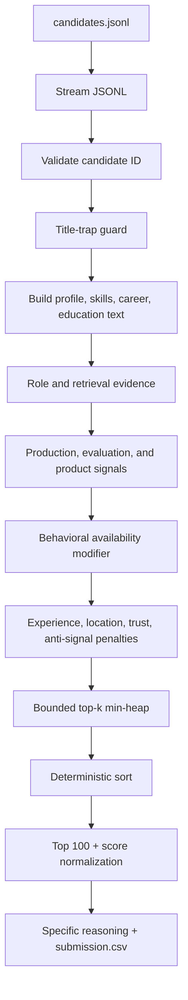

# RedRob Ranker — India Runs 2026 Track 1

A deterministic, offline candidate-ranking system for the **Hack2Skill × Redrob India Runs Intelligent Candidate Discovery & Ranking Challenge**.

Built by [Yash Sharma](https://yashsharma01.vercel.app/) · [GitHub](https://github.com/Yashsh101)

## What the Official Task Requires

The released task is to rank 100,000 candidate profiles for the provided **Senior AI Engineer — Founding Team** job description. The system must understand the role, combine profile/career/behavioral signals, and write the top 100 candidates in the required CSV format.

The official reproduction constraints are **≤5 minutes**, **≤16 GB RAM**, **CPU only**, **no network calls during ranking**, and **≤5 GB intermediate disk**. The official scoring formula is:

```text
0.50 × NDCG@10 + 0.30 × NDCG@50 + 0.15 × MAP + 0.05 × P@10
```

The official package contains the candidate pool, job description, schema, behavioral-signal reference, submission specification, validator, metadata template, and sample output. It does **not** contain the hidden relevance labels, so this repository cannot honestly report the official NDCG/MAP score.

## System Design

The ranker is deliberately **CPU-only, deterministic, and offline**. It does not call OpenAI, Anthropic, Cohere, Gemini, or any other hosted model during ranking. It uses the released JD semantics as explicit, inspectable scoring signals rather than pretending that keyword count alone is semantic understanding.


```mermaid
flowchart TD
    A[candidates.jsonl] --> B[Stream JSONL]
    B --> C[Validate candidate ID]
    C --> D[Title-trap guard]
    D --> E[Build profile, skills, career, education text]
    E --> F[Role and retrieval evidence]
    F --> G[Production, evaluation, and product signals]
    G --> H[Behavioral availability modifier]
    H --> I[Experience, location, trust, anti-signal penalties]
    I --> J[Bounded top-k min-heap]
    J --> K[Deterministic sort]
    K --> L[Top 100 + score normalization]
    L --> M[Specific reasoning + submission.csv]
```

### Ranking signals

The released JD emphasizes production retrieval/ranking systems, embeddings or vector search, strong Python, evaluation literacy, recent coding, product-company experience, Pune/Noida flexibility, and real availability. It explicitly warns against keyword-stuffed profiles, framework-only experience, pure research without deployment, consulting-only histories, and vision/speech/robotics profiles without NLP/IR evidence.

The implementation reflects those requirements through:

| Signal group | Implementation |
| --- | --- |
| Role evidence | Current title/headline, career titles, and job-relevant role terms |
| Retrieval and ranking | Retrieval, vector search, hybrid search, BM25, reranking, recommendation, and search terms, weighted more heavily in career history |
| ML/LLM | NLP, embeddings, transformers, LLM, fine-tuning, Python, and related terms |
| Production | Deployment, serving, inference, shipped, scale, latency, API, MLOps, and cloud evidence |
| Evaluation | NDCG, MRR, MAP, ranking evaluation, benchmark, precision, recall, regression, and experiment evidence |
| Skill quality | Proficiency, duration, endorsements, and Redrob assessment scores; suspicious expert skills with zero duration receive a penalty |
| Experience | Continuous score centred on the released JD's flexible 5–9 year band and 6–8 year ideal |
| Behavioral availability | Last-active recency, recruiter response, interview completion, profile completeness, GitHub activity, recruiter searches/saves, verification, open-to-work, and notice period |
| Product fit | Product-industry evidence and a bounded consulting-heavy penalty |
| Anti-signals | Title traps, stale/low-response candidates, short-history contradictions, research-only evidence, vision/speech-only evidence, framework-only evidence, and suspicious skill claims |
| Explainability | Every row receives a rank-consistent 1–2 sentence reasoning string based only on candidate fields |

Availability is a modifier on evidence-based fit, not an independent ranking engine. This prevents a highly active but technically irrelevant profile from beating a candidate who has actually shipped retrieval, ranking, or recommendation systems.

## Repository Structure

```text
redrob-ranker/
├── rank.py                         # Official-data ranking engine
├── validate_submission.py          # Local mirror of official CSV checks
├── evaluate_submission.py          # NDCG/MAP/P@10 evaluator for labels when available
├── submission.csv                  # Generated top-100 output
├── official_run_diagnostics.json   # Feature evidence for this official run
├── tests/test_rank.py              # Unit tests
├── requirements.txt                # Runtime: Python standard library only
├── requirements-dev.txt            # pytest for local testing
├── submission_metadata.example.yaml# Portal metadata template with placeholders
├── .github/workflows/rank.yml      # Existing ranking workflow
└── README.md
```

## Local Setup

```bash
git clone https://github.com/Yashsh101/redrob-ranker.git
cd redrob-ranker
python -m venv .venv
source .venv/bin/activate                 # Windows: .venv\\Scripts\\Activate.ps1
python -m pip install -r requirements-dev.txt
```

No runtime package, model download, API key, GPU, or network connection is required for ranking.

## Run the Official Dataset

Place the official `candidates.jsonl` outside Git or pass its absolute path directly. The released dataset is intentionally excluded by `.gitignore`.

```bash
python rank.py \
  --candidates /path/to/candidates.jsonl \
  --out submission.csv \
  --topk 300 \
  --diagnostics official_run_diagnostics.json
```

The ranker automatically uses the maximum `last_active_date` in the input as the dataset cutoff. To force a reproducible cutoff explicitly:

```bash
python rank.py \
  --candidates /path/to/candidates.jsonl \
  --out submission.csv \
  --topk 300 \
  --as-of-date 2026-05-27
```

The required single-command reproduction path is:

```bash
python rank.py --candidates ./candidates.jsonl --out ./submission.csv
```

`--topk` defaults to 300 and must be at least 100. The scorer streams JSONL, keeps a bounded heap, and writes exactly 100 rows.

## Validate the Submission

The organizer’s validator requires the exact header, 100 rows, unique IDs and ranks, ranks 1–100, numeric non-increasing scores, and UTF-8 CSV. This repository includes a local validator with an additional normalized-score option:

```bash
python validate_submission.py submission.csv --require-normalized
```

At portal upload time, rename the file to the registered participant ID required by the official specification, for example `team_xxx.csv`. The repository output remains `submission.csv` for reproducibility.

## Evaluate with Ground-Truth Labels

The official bundle does not include labels; the leaderboard ground truth is hidden. When the organizer supplies labels, use a file containing `candidate_id` and one of `relevance`, `tier`, or `label`:

```bash
python evaluate_submission.py \
  --submission submission.csv \
  --labels relevance_labels.csv
```

The evaluator reports `NDCG@10`, `NDCG@50`, `MAP`, `P@10` using tier `3+` as relevant, and the official composite formula. For valid experimentation, tune weights on a development split and report final metrics only on an untouched holdout. Do not infer official performance from the organizer’s `sample_submission.csv`; that file is explicitly a format reference, not a high-quality ranking.

## Testing

```bash
python -m pytest -q
python -m py_compile rank.py validate_submission.py evaluate_submission.py
python validate_submission.py submission.csv
```

The test suite covers official-schema candidates, title traps, experience scoring, deterministic explanations, technical-fit preference, stale/low-response behavior, normalized output, and invalid numeric handling.

## Measured Official-Dataset Run

The redesigned ranker was run against the attached official 100,000-record dataset.

| Measurement | Result |
|---|---:|
| Records scanned | 100,000 |
| Invalid records | 0 |
| Output rows | 100 |
| Title-trap records filtered | 63,030 |
| Wall-clock time | 204.6 seconds in the sandbox |
| Peak RSS | 21.45 MB in the sandbox |
| CPU/network mode | Standard-library CPU run; no network calls |
| Organizer validator | Passed |
| Repository validator | Passed |
| Unit tests | 7 passed |

This run is within the official 5-minute and 16 GB limits in the observed environment. The result is an engineering/resource measurement, not an official leaderboard score.

## Current Run Diagnostics

The generated `official_run_diagnostics.json` records the scoring evidence for each top-100 candidate, including raw score, role/retrieval/ML/production/evaluation evidence, behavioral features, matched skills, and concerns. The top 10 of the measured run contained zero configured off-domain titles, zero suspicious zero-duration expert-skill profiles, and full coverage of retrieval/ranking, ML/LLM, production, and evaluation evidence.

The top-10 averages from this run were: fit score **30.3987**, experience score **4.78**, behavior modifier **0.9159**, recruiter response **68.5%**, notice period **36 days**, and last-active age **32.8 days** relative to the dataset cutoff. These are descriptive run statistics, not ground-truth quality metrics.

## Submission Metadata

Copy `submission_metadata.example.yaml` to `submission_metadata.yaml` and fill in verified portal details before upload. The official metadata requires team identity, primary contact, member list, GitHub URL, a runnable sandbox/demo link, reproduction command, compute environment, AI-tool declaration, methodology summary, and declarations.

Do not invent a team name, participant ID, sandbox link, or AI-tool declaration. The official specification states that the sandbox must accept a small candidate sample, run end to end on CPU, and produce a ranked CSV.

## Important Limitations

The attached package contains no hidden relevance labels, so this repository cannot calculate or claim official NDCG, MAP, P@10, composite score, leaderboard position, or honeypot rate against the organizer’s hidden ground truth. The ranker has an explicit honeypot-resistance heuristic, but the official honeypot labels remain private.

The scorer is a transparent feature-based ranker, not a learned model or embedding model. It is optimized for reproducibility and explainability under the official offline CPU constraint. If labels become available, the next evidence-based step is a train/development/holdout experiment comparing this ranker with a lexical baseline, a calibrated feature model, and ablations of each heuristic.

## Official References

- [India Runs official event brief](https://hack2skill.com/event/india_runs/)
- Official `submission_spec.docx` from the attached India Runs participant package
- [India Runs official terms](https://hack2skill.com/event/india_runs/tnc)
- [Redrob India Runs hiring page](https://hack2skill.com/event/india_runs/career/)
- [Repository](https://github.com/Yashsh101/redrob-ranker)

## License

No standalone `LICENSE` file was verified in the current repository. Confirm the intended license before public distribution.
