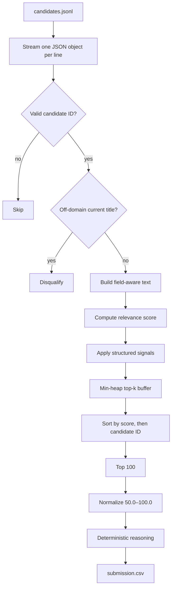

# RedRob Ranker — India Runs 2026

A deterministic, streaming candidate-ranking system for the **Hack2Skill × Redrob India Runs Track 1: Data & AI Challenge**.

Built by [Yash Sharma](https://yashsharma01.vercel.app/) · [GitHub](https://github.com/Yashsh101)

> **Verified challenge objective:** build a workable proof of concept that ranks candidates for intelligent candidate discovery using profile attributes, career metadata, and activity/behavioural signals, then submit the code, methodology, and ranked output file. [Official Track 1 brief](https://hack2skill.com/event/india_runs/)

## Challenge Alignment

The official Track 1 brief asks participants to move beyond surface-level filtering, understand contextual fit, integrate profile/career/activity signals, and deliver a fast ranked shortlist. This repository implements a CPU-only deterministic ranker for the Senior AI/ML Engineer role modelled in the challenge. It is not an embedding model, an LLM system, or a learned ranking model; it is a reproducible rule-based proof of concept.

The official event page lists the Track 1 submission close date as **2 July 2026** and the Track 1/2 evaluation period as **3–16 July 2026**. The repository documents the implementation and can be reproduced independently; no leaderboard score is claimed here because the held-out relevance labels and candidate dataset are not stored in the repository.

## What the System Does

The ranker reads a JSONL candidate pool one record at a time, validates candidate IDs, removes clearly off-domain current titles, computes a bounded composite relevance score, keeps only the highest-scoring candidates in a min-heap, and writes the top 100 rows to CSV.

The score combines six evidence groups:

1. **Keyword relevance:** token-safe matching over JD-derived core and bonus terms with logarithmic scaling for core hits.
2. **Role alignment:** stronger weight for technical evidence in the current title/headline, followed by skills, summary, and career history.
3. **Experience fit:** a continuous piecewise-linear curve centred on the 5–9 year senior range.
4. **Availability:** notice period, open-to-work flag, response rate, and platform activity. Availability is damped when technical relevance evidence is weak so it cannot dominate the shortlist on its own.
5. **Product tilt:** a proportional signal based on the share of career roles at configured IT-services companies.
6. **Recency:** a tiered boost from the latest career role's title and first 400 description characters.

Scores are computed before ranking and normalised after ranking to the inclusive **50.0–100.0** presentation range. Reasoning strings are generated deterministically from candidate fields and the candidate ID.

## Architecture


```mermaid
flowchart TD
    A[candidates.jsonl] --> B[Stream one JSON object per line]
    B --> C{Valid candidate ID?}
    C -->|no| X1[Skip]
    C -->|yes| D{Off-domain current title?}
    D -->|yes| X2[Disqualify]
    D -->|no| E[Build field-aware text]
    E --> F[Compute relevance score]
    F --> G[Apply structured signals]
    G --> H[Min-heap top-k buffer]
    H --> I[Sort by score, then candidate ID]
    I --> J[Top 100]
    J --> K[Normalize 50.0–100.0]
    K --> L[Deterministic reasoning]
    L --> M[submission.csv]
```

The process is single-pass over the input and keeps the heap bounded by `--topk`. The runtime uses only the Python standard library; there is no network call, model download, GPU dependency, or external service.

## Input Contract

The ranker expects one JSON object per line. The repository intentionally does not include the challenge candidate dataset; `.gitignore` excludes `candidates.jsonl` and other JSONL files.

The fields read by the implementation are:

| Field | Used for |
| --- | --- |
| `candidate_id` | Validation and deterministic tie-breaking; expected format is `CAND_` followed by seven digits |
| `profile.current_title` | Title guard and role-alignment evidence |
| `profile.headline` | Role-alignment evidence |
| `profile.summary` | Searchable technical evidence, truncated to 600 characters |
| `profile.years_of_experience` | Experience-fit curve |
| `skills[].name`, `skills[].category` | Keyword and role-alignment evidence |
| `career_history[].title`, `career_history[].description` | Role alignment and recency boost; descriptions are bounded per role |
| `career_history[].company` | Product-tilt signal |
| `redrob_signals.notice_period_days` | Availability |
| `redrob_signals.open_to_work_flag` | Availability |
| `redrob_signals.response_rate` | Availability, clamped to 0–1 |
| `redrob_signals.platform_activity_score` | Availability, clamped to 0–1 |
| `education[].degree`, `education[].field` | Searchable text |

Example input record:

```json
{"candidate_id":"CAND_0000001","profile":{"current_title":"Senior ML Engineer","headline":"RAG and machine learning engineer","summary":"Builds retrieval and LLM systems","years_of_experience":7},"skills":[{"name":"RAG","category":"GenAI"},{"name":"Python","category":"Language"}],"career_history":[{"title":"ML Engineer","company":"Example Product","description":"Built embeddings and vector search systems."}],"education":[{"degree":"MCA","field":"Computer Applications"}],"redrob_signals":{"notice_period_days":15,"open_to_work_flag":true,"response_rate":0.85,"platform_activity_score":0.9}}
```

## Output Contract

The ranker writes exactly four CSV columns:

```csv
candidate_id,rank,score,reasoning
CAND_0000001,1,100.0,"Senior ML Engineer | 7.0yr exp | Top skills: RAG, Python | Notice: 15d · open-to-work | Response rate: 85% | Score: 100.0/100"
```

`validate_submission.py` checks the exact column order, 100 data rows, unique candidate IDs, ordered ranks `1..100`, valid candidate ID format, numeric scores, and non-empty reasoning. Use `--require-normalized` for output generated by the current ranker.

## Reproduction

```bash
git clone https://github.com/Yashsh101/redrob-ranker.git
cd redrob-ranker
python --version                 # Python 3.10+ recommended
python rank.py \
  --candidates path/to/candidates.jsonl \
  --out submission.csv \
  --topk 300
python validate_submission.py submission.csv --require-normalized
```

`--candidates` and `--out` are required. `--topk` defaults to 300 and must be at least 100. The ranker prints scanned, skipped, disqualified, and heap-size counters while running.

## Development and Testing

The production ranker has no third-party runtime dependencies. For development and tests:

```bash
python -m venv .venv
source .venv/bin/activate                 # Windows: .venv\\Scripts\\Activate.ps1
python -m pip install -r requirements-dev.txt
python -m pytest -q
python -m py_compile rank.py validate_submission.py
python validate_submission.py submission.csv
```

The test suite covers invalid numeric values, title disqualification, experience scoring, normalization, deterministic reasoning, role alignment, availability dampening, token-safe keyword matching, and empty-input normalization.

## Continuous Integration

`.github/workflows/rank.yml` currently runs on pushes to `main` that change `rank.py` or `candidates.jsonl`, and it supports manual dispatch with a configurable `topk` value. It sets up Python 3.11, installs `requirements.txt`, runs the ranker when `candidates.jsonl` is present, conditionally runs `validate_submission.py` when both the output and validator are present, and uploads `submission.csv` as an artifact.

The workflow does not run the local pytest suite because the GitHub token used for this repository cannot create or update workflow files without the `workflow` scope. The stricter pytest-and-validation workflow was prepared locally but was not pushed. The raw challenge dataset is not committed, so a full dataset ranking run still requires the challenge input file.

## Repository Structure

```text
redrob-ranker/
├── rank.py                         # Streaming ranking engine
├── validate_submission.py          # CSV contract validator
├── submission.csv                  # Checked-in ranked-output artifact
├── tests/test_rank.py              # Focused unit tests
├── requirements.txt                # Empty runtime dependency set
├── requirements-dev.txt            # Test dependency
├── .github/workflows/rank.yml      # Test, rank-when-data-exists, validate, upload
├── .gitignore                      # Excludes raw candidate data and local artifacts
└── README.md                       # Methodology and reproduction guide
```

## Design Decisions and Limits

The implementation uses deterministic lexical and structured signals rather than a learned model. This makes runs reproducible and keeps the system offline and dependency-free, but it does not provide semantic embeddings, BM25 term-frequency scoring, supervised learning-to-rank, calibration against held-out labels, or a measured leaderboard score.

The title guard is intentionally conservative and can exclude a career changer whose current title contains a configured off-domain term. The product-tilt signal relies on a maintained list of known service companies. The ranker assumes the first career-history item is the latest role, as documented in the implementation.

The committed `submission.csv` is a historical artifact from an earlier ranker version: its rows and score values do not prove the current algorithm's output. It was not regenerated in this update because `candidates.jsonl` is absent from the repository and is excluded by `.gitignore`. To generate a current submission, provide the challenge dataset and run the reproduction commands above.

## Official References

- [India Runs official event page — Track 1 brief, checklist, timeline](https://hack2skill.com/event/india_runs/)
- [India Runs official terms and conditions](https://hack2skill.com/event/india_runs/tnc)
- [India Runs hiring page](https://hack2skill.com/event/india_runs/career/)
- [Repository](https://github.com/Yashsh101/redrob-ranker)

## License

MIT — see the repository history and project files for the current licensing state.
