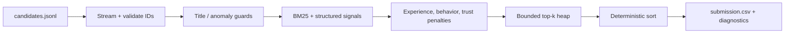

# RedRob Ranker

[](https://github.com/Yashsh101/redrob-ranker/actions/workflows/ci.yml)
[](LICENSE)

Offline, deterministic candidate ranking for the **India Runs 2026 Track 1 AI Engineer challenge**. It reads candidate JSONL, combines BM25 relevance with structured signals and guardrails, and writes a reproducible ranked CSV.

## Problem

Keyword-only ranking can reward title traps, shallow skill mentions, and incomplete profiles. This project makes the ranking logic inspectable: retrieval evidence, experience, availability, profile completeness, and anti-signal penalties are explicit in code and diagnostics.

## Demo / Output

The committed example output is [`data/output/submission.csv`](data/output/submission.csv). It contains the challenge-shaped top-100 output and can be checked locally with the repository validator. No public hosted demo is claimed; the ranker is intentionally offline.

## Architecture


```mermaid
flowchart LR
  A[candidates.jsonl] --> B[Stream + validate IDs]
  B --> C[Title / anomaly guards]
  C --> D[BM25 + structured signals]
  D --> E[Experience, behavior, trust penalties]
  E --> F[Bounded top-k heap]
  F --> G[Deterministic sort]
  G --> H[submission.csv + diagnostics]
```

See [`docs/architecture.md`](docs/architecture.md) and [`docs/reports/RANKING_METHODOLOGY.md`](docs/reports/RANKING_METHODOLOGY.md).

### Key engineering decisions

- **Offline and CPU-only:** no network calls or hosted model dependency during ranking.
- **Deterministic:** ties use `(-score, candidate_id)` ordering.
- **Bounded selection:** a min-heap limits retained candidates before final sorting.
- **Explainability:** each result includes score components and ranking evidence.
- **Challenge safety:** validation is separate from ranking and checks output shape, IDs, ranks, and normalized scores.

## Quickstart

### 1. Clone

```bash
git clone https://github.com/Yashsh101/redrob-ranker.git
cd redrob-ranker
```

### 2. Configure

```bash
python3 -m venv .venv
. .venv/bin/activate
python -m pip install --upgrade pip
python -m pip install -e ".[dev]"
cp .env.example .env
```

No secret or external service is required. The released challenge dataset is not included; use a local JSONL file with the expected candidate schema.

### 3. Run

```bash
python rank.py --candidates /path/to/candidates.jsonl --out data/output/submission.csv --topk 100
python scripts/validate.py data/output/submission.csv --require-normalized
```

## Verification commands

```bash
ruff check .
pytest --cov=ranker --cov-report=term-missing
python -m build
python scripts/validate.py data/output/submission.csv --require-normalized
```

The same install, lint, test, package-build, and output-validation gates run in [GitHub Actions](.github/workflows/ci.yml).

## Evaluation

- **Dataset:** The organizer’s released candidate JSONL and labels are required for end-to-end challenge evaluation; they are not committed here.
- **Implemented metrics:** `scripts/evaluate.py` computes nDCG@10, nDCG@50, MAP, P@10, and a documented composite when a labeled file is available.
- **Reproduction:**

  ```bash
  python scripts/evaluate.py \
    --submission data/output/submission.csv \
    --labels /path/to/labels.csv
  ```

- **Baseline:** No benchmark baseline is claimed until the released dataset and label file are available in the same environment.
- **Current status:** Repository tests and committed-output validation pass locally. Official challenge score, runtime, and peak memory are **pending verification**.

## Failure cases and limitations

- Malformed JSONL, missing candidate IDs, duplicate IDs, and invalid output rows are rejected by validation.
- Missing or sparse profile fields reduce signal quality; the system does not infer facts absent from the input.
- The behavioral modifier depends on fields present in the challenge data and is not a measure of candidate quality outside that task.
- BM25 and hand-authored weights are interpretable but require calibration against labeled outcomes.
- No network, live enrichment, fairness audit, or production access-control layer is included.

## Security and deployment status

The ranker processes local files and does not transmit candidate data. Treat candidate JSONL, diagnostics, and generated submissions as sensitive. Do not commit private datasets or credentials. `.env.example` documents that no runtime secret is needed.

**Deployment:** local/offline CLI only. No hosted API or live demo is claimed.

## Roadmap / pending verification

1. Run the organizer-labeled dataset through `scripts/evaluate.py` and publish the resulting metrics with the dataset provenance.
2. Add a reproducible runtime and peak-memory benchmark for the released dataset.
3. Add end-to-end CLI fixtures for malformed JSONL, duplicate IDs, and output-file failures.

## License

MIT — see [`LICENSE`](LICENSE).
